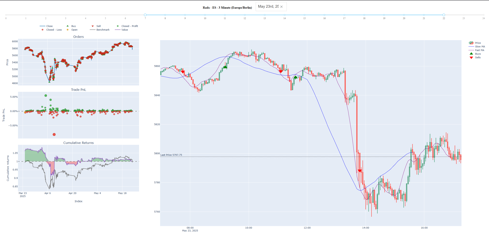

## Radx

Simple dashboard to preview your backtested strategy and live price.



## Quickstart

- Install uv `curl -LsSf https://astral.sh/uv/install.sh | sh`

- Env/config (and add your credentials)
```cp .env.example .env```

- Run
`uv run main.py --ui`

- Access UI at
`http://127.0.0.1:8050/`

### Docs:
- TopstepX api https://gateway.docs.projectx.com/docs/intro (api)
- SignalR https://gateway.docs.projectx.com/docs/realtime/ (websocket)
- Uv https://github.com/astral-sh/uv (python env)
- Dash https://dash.plotly.com/ (ui)
- Vbt https://vectorbt.dev/ (backtesting)

- Formatter (vscode ext)
```
 "[python]": {
    "editor.defaultFormatter": "ms-python.black-formatter",
    "editor.formatOnSave": true
  }
```